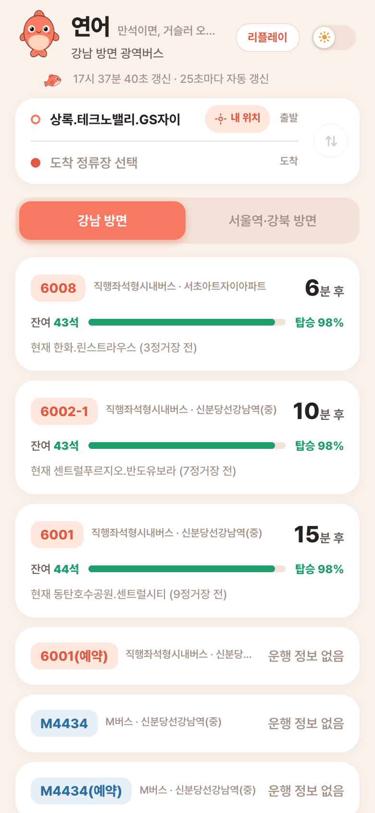
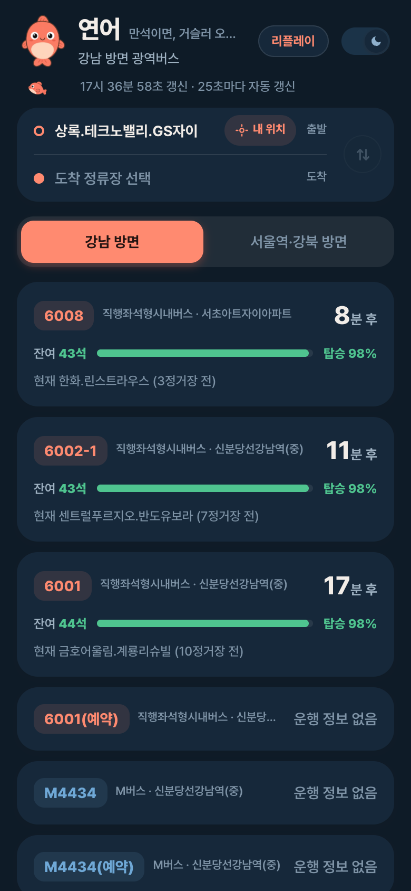
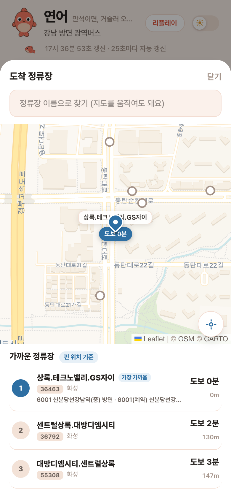
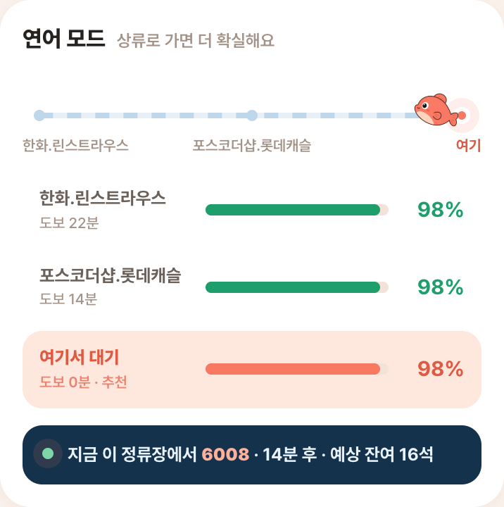

<div align="center">


<br/><br/>

**연어는 상류로 거슬러 오릅니다. 만석 버스 앞의 당신도 그럴 수 있어요.**

집 앞 정류장에선 늘 만석인 광역버스 — 몇 정류장만 거슬러 올라가면 자리가 있습니다.
연어는 실시간 잔여좌석과 예측으로 **어디서 타야 앉아서 출근하는지** 알려주는 PWA입니다.

<br/>

[](https://yeoneo.vercel.app)


</div>


## 📱 미리보기

<table>
<tr>
<td width="33%" valign="top"></td>
<td width="33%" valign="top"></td>
<td width="33%" valign="top"></td>
</tr>
<tr>
<td align="center"><sub>☀️ 선셋새먼 보드 — 잔여좌석·탑승확률</sub></td>
<td align="center"><sub>🌙 딥리버 다크</sub></td>
<td align="center"><sub>🗺️ 지도 정류장 픽커</sub></td>
</tr>
</table>


## 🐟 왜 "연어"인가요?


출근길 광역버스가 정류장에 들어옵니다. **만석**입니다. 다음 버스도, 그다음 버스도.

그런데 노선을 거슬러 올라가 보면 — 두세 정류장 상류에서는 아직 좌석이 남아 있습니다.
연어가 강을 거슬러 오르듯, **몇 분만 걸어 올라가면 앉아서 갈 수 있다**는 것.
연어는 그 판단을 대신해 주는 앱입니다.

- 지금 오는 버스의 **잔여좌석**은 몇 석인지
- 내 정류장에 **도착할 때쯤엔** 몇 석이 남을지
- 만석이라면 **어느 상류 정류장까지** 걸어가는 게 총 통근시간이 가장 짧은지

<br/>


## ✨ 핵심 기능

<table>
<tr>
<td width="50%" valign="top">

### 🚏 F1 · 실시간 정류장 보드

방향 탭으로 상·하행을 오가며 노선별 **잔여좌석을 실시간 카드**로 보여줍니다.
25초 폴링(비피크 시간대엔 자동 감속), 당겨서 새로고침, 쿼터 초과 시에도
보드 전체가 죽지 않고 노선카드 + 배너로 우아하게 버팁니다.

</td>
<td width="50%" valign="top">

### 🔮 F2 · 도달 시 좌석 예측

지금 좌석이 아니라 **내 정류장에 도착할 때의 좌석**을 예측합니다.
시간대(피크/비피크) · 배차간격 · 상류 정류장 수 · 최근 통과 대수 · 2층버스
여부를 반영한 룰 기반 모델로, **탑승확률과 판단 근거**까지 함께 보여줍니다.

</td>
</tr>
<tr>
<td width="50%" valign="top">

### 🐟 F3 · 연어 모드

만석이 예상되면 **상류 정류장 체인**을 거슬러 올라가며 대안을 탐색합니다.
도보 시간(하버사인 · 4km/h)을 포함한 **총 통근시간**으로 비교해
"3정거장 올라가서 타면 12분 손해로 앉아 간다"를 알려줍니다.

</td>
<td width="50%" valign="top">

### 🤖 F4 · AI 브리핑

오늘 아침 상황을 한 문단으로 요약해 주는 브리핑.
Gemini **3.1-flash-lite → 2.5-flash-lite → 룰 기반** 폴백 체인이라
API 한도가 터져도 브리핑은 항상 나옵니다.

</td>
</tr>
</table>


## 🌊 연어 모드, 이렇게 움직입니다

<div align="center">

</div>

1. 출발 정류장의 도착 정보에서 **만석 위험**을 감지하면
2. 노선의 **상류 정류장 체인**을 동적으로 따라 올라가며 각 정류장의 도달 시 좌석을 예측하고
3. `도보 + 대기 + 승차` 총 소요를 비교해 **가장 빨리 앉아 가는 출발지**를 추천합니다

<div align="center">


<sub>🐟 실제 화면 — 체인 위를 헤엄치는 연어와 정류장별 확률 비교</sub>
</div>

<details>
<summary><b>🧮 예측 공식 자세히 보기</b></summary>

<br/>

정류장당 승차 인원을 도착률 기반으로 추정하고, 탑승확률은 승차 수요를
포아송 과정으로 본 정규근사로 계산합니다.

```
정류장당 승차 = (시간대별 base ÷ 전형 배차간격) × 실제 배차간격 − 최근통과 완화
             × (2층버스면 좌석공급 완화 계수)

예상 승차 λ  = 정류장당 승차 × 상류 정류장 수
도달 시 좌석 = 현재 잔여좌석 − λ
탑승확률    = Φ( 도달 시 좌석 ÷ √(φ·λ) )     # 승차 ~ Poisson(λ), φ = 과산포 계수
```

계수는 [constants/stops.ts](constants/stops.ts)의 `PREDICT_COEF`에 모여 있고,
[scripts/check-predict.ts](scripts/check-predict.ts)로 검증합니다.
`base`와 `φ`는 감으로 정한 값이 아니라 실측으로 피팅합니다 —
출근시간 녹화(`npm run record`)에서 버스를 차량번호로 추적해
정류장당 실제 승차를 측정하고, `npm run fit`이 계수 제안과
현행 대비 백테스트 오차(MAE)를 출력합니다.

</details>


## 🗺️ 이런 것도 됩니다

|  |  |
|:--:|:--|
| 🗺️ | **지도 정류장 픽커** — 핀 주변 정류소 · 도보시간 · GPS · 검색 통합, 방면 표시로 상·하행 쌍둥이 정류장 구분 |
| 📍 | **현위치 원탭 출발** — 지금 서 있는 곳에서 가장 가까운 정류장을 한 번에 출발지로 |
| 🔁 | **출발/도착 입력 패널** — 네이버 길찾기식 두 행 카드 + 스왑 버튼 |
| 📲 | **PWA 설치** — `beforeinstallprompt` 자체 버튼 + iOS 수동 안내, maskable 아이콘 |
| 🌙 | **다크모드** — 선셋새먼 라이트 / 딥리버 다크 스킨 (기본 라이트) |
| 📼 | **리플레이 모드** — 출근시간 녹화 fixture를 12배속 타임라인으로 재생, 정직 표기 배너 |


## 🚀 시작하기


```bash
git clone https://github.com/noino0819/yeoneo.git
cd yeoneo
npm install
```

`.env.local`에 키 두 개:

```bash
GG_BUS_API_KEY=공공데이터포털_인증키   # 경기도 버스정보 v2 (도착·위치·노선·정류소) 활용신청
GEMINI_API_KEY=Gemini_API_키          # 없어도 됨 — 룰 기반 브리핑으로 폴백
```

```bash
npm run dev   # http://localhost:3000
```

### 스크립트

| 명령 | 설명 |
|:--|:--|
| `npm run dev` | 개발 서버 |
| `npm run record` | 출근시간 도착정보 녹화 (HOME + 상류 체인 동시) |
| `npm run fit` | 녹화에서 예측 계수 실측 피팅 + 백테스트 |
| `npm run check` | 좌석 예측 로직 검증 |
| `npm run setup:constants` | 정류장 · 노선 상수 셋업 |

## 📁 구조

```
app/
├─ api/                 # 경기버스 API 프록시 (arrivals · vehicles · predict · briefing · salmon · replay …)
├─ page.tsx             # 메인 보드 (F1~F4)
├─ station-picker.tsx   # 지도 기반 정류장 픽커 (Leaflet)
└─ salmon/              # 마스코트 🐟
constants/stops.ts      # HOME_STOP · 예측 계수 · 노선 태그
lib/
├─ ggbus.ts             # 경기도 버스정보 API 클라이언트
├─ predict.ts           # F2 좌석 예측 (룰 기반, 순수함수)
├─ salmon.ts            # F3 상류 체인 조립 (라이브·리플레이 공유)
└─ walk.ts              # 하버사인 도보 시간
scripts/                # 녹화 · 피팅 · 검증 · 상수 셋업
fixtures/               # 리플레이용 녹화 데이터
```

> 데이터 출처: [공공데이터포털](https://www.data.go.kr) 경기도 버스정보 서비스 v2


<div align="center">
<br/>


**오늘도 앉아서 출근하세요 🎫**

만석 버스를 세 대 보낸 어느 통근러가 만들었습니다

</div>
